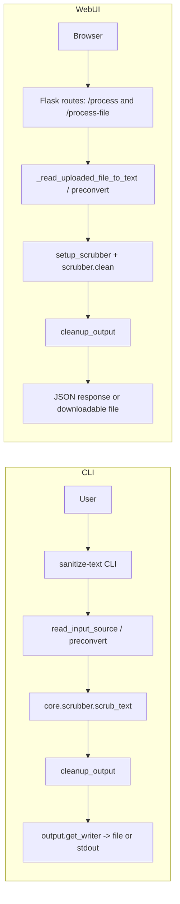

<!-- SECTIONS:API,CLI,WEBUI,CI,DOCKER,TESTS -->

# Project Overview | sanitize-text

sanitize-text detects and removes personally identifiable information (PII) from text and common document formats for Dutch (`nl_NL`) and English (`en_US`), via a shared scrubbing core, a Click-based CLI, and a Flask web UI.

[](https://www.python.org/)
[](#version-summary)
[](LICENSE)

## Table of Contents

- [Quickstart for Developers](#quickstart-for-developers)
- [Version Summary](#version-summary)
- [Project Features](#project-features)
- [Project Structure](#project-structure)
- [Architecture Highlights](#architecture-highlights)
- [API](#api)
- [CLI](#cli)
- [WebUI](#webui)
- [Docker](#docker)
- [Tests](#tests)
- [CI/CD](#cicd)

## Quickstart for Developers

```bash
git clone https://github.com/beecave-homelab/sanitize-text.git
cd sanitize-text
python3.11 -m venv .venv && source .venv/bin/activate
pip install -U pip
pip install -r requirements.txt
pdm install  # optional, if you use PDM locally
pdm run ruff check .
pdm run pytest -q
```

> **Dependency management**: Do not edit `requirements.txt`, `requirements.dev.txt`, or `requirements.all.txt` manually. Instead, add or update dependencies in [`pyproject.toml`](pyproject.toml) (or via `pdm add ...`), then regenerate the requirement files with:

```bash
pdm export --pyproject --no-hashes --prod -o requirements.txt
pdm export --pyproject --no-hashes --dev -o requirements.dev.txt
pdm export --pyproject --no-hashes -G :all -o requirements.all.txt
```

## Version Summary

| Version | Date | Type | Key Changes |
|---------|------|------|-------------|
| 1.4.2 | 30-11-2025 | 🐛 | Docker image fixes (ffmpeg), corrected OCI labels, and PR CI for the dev branch. |
| 1.4.1 | 24-11-2025 | 🐛 | Docker build workflow for main/PRs, updated Dockerfile and dev environment, improved .gitignore hygiene. |
| 1.4.0 | 23-11-2025 | ✨ | Removed locale headers from scrubbed output, added GHCR metadata, and improved temp file cleanup. |
| 1.3.0 | 23-11-2025 | ✨ | CLI/WebUI verbose logging improvements and entity detector refactor. |
| 1.2.0 | 22-11-2025 | 🐛 | Configurable WebUI CLI options, Click-based integration tests, and markdownlint/config fixes. |
| 1.1.0 | 22-11-2025 | ✨ | SOLID-aligned refactors, shared multi-locale helper, WebUI logging, and documentation updates. |
| 1.0.0 | 21-11-2025 | ✨ | WebUI redesign, new CLI/web UI entry points, multi-format document support, and improved PDF/Markdown flows. |
| 0.1.0 | N/A | 🔧 | Initial packaged version before WebUI and CLI enhancements. |

## Project Features

- **Multi-locale PII scrubbing** for Dutch (`nl_NL`) and English (`en_US`) via a shared detector catalogue.
- **Configurable detectors** (email, phone, URL, IPs, names, organizations, locations, `date_of_birth`, optional spaCy entities).
- **CLI workflow** for streaming text, files, stdin, and append mode with rich output formats (txt/md/docx/pdf).
- **Web UI** for interactive scrubbing, detector selection, CLI command preview, and file upload/download.
- **Entity management tool** to extend Dutch city/name/organization lists stored under [`sanitize_text/data/nl_entities`](sanitize_text/data/nl_entities).
- **Binary/rich document support** via pre-conversion utilities for PDF, DOC/DOCX, RTF, and image OCR.
- **Export pipeline** to TXT/DOCX/PDF with layout-aware PDF rendering and cleanup of placeholders/gibberish.
- **Test suite** covering CLI, WebUI, core scrubber, detectors, normalization, and output writers.

## Project Structure

<details><summary>Show tree</summary>

```text
sanitize_text/                # Library and application package
  cli/                        # Click-based CLI entrypoints and IO helpers
  core/                       # Scrubber orchestration and detector catalogue
  webui/                      # Flask app factory, routes, templates, static assets
  utils/                      # Pre-conversion, I/O helpers, cleanup, NLP resources, PDF helpers, post-processors, custom detectors
  add_entity/                 # CLI to extend Dutch entity JSON lists
  data/                       # Locale-specific entity data (nl_entities/, en_entities/)
scripts/                      # Helper scripts for conversion and data extraction
tests/                        # Pytest suite for core, CLI, WebUI, utils, outputs
```

</details>

## Architecture Highlights

- **Layered design**: core scrubbing engine in [`sanitize_text/core/scrubber.py`](sanitize_text/core/scrubber.py).
- **Detector catalogue**: detectors declared via `DetectorSpec`/`DetectorContext` dataclasses with locale-aware enabling.
- **UI frontends**: CLI in [`sanitize_text/cli/main.py`](sanitize_text/cli/main.py) and Flask WebUI in [`sanitize_text/webui`](sanitize_text/webui) share the same scrubber and output writers.
- **Shared file-to-text helpers**: `sanitize_text.utils.io_helpers.read_file_to_text` is used by both the CLI (`cli.io.read_input_source`) and WebUI (`webui.helpers.read_uploaded_file_to_text`) to treat PDFs, Office docs, RTF, and images consistently.
- **CLI flow** reads input (`--text`/`--input`/stdin/append) via `sanitize_text.cli.io.read_input_source`, routes it through `_run_scrub()`, applies generic cleanup, and uses `output.get_writer()` for TXT/MD/DOCX/PDF artifacts.
- **WebUI flow** mirrors CLI semantics: routes in [`sanitize_text/webui/routes.py`](sanitize_text/webui/routes.py) scrub text or uploaded files, enrich responses with filth metadata, and stream downloadable artifacts.
- **Pre-conversion** uses [`sanitize_text/utils/preconvert.py`](sanitize_text/utils/preconvert.py) and, optionally, `markitdown`/`pymupdf4llm` and `tesseract` to normalize PDFs, Office docs, RTF, and images into text.
- **Cleanup + post-processing**: [`sanitize_text/utils/cleanup.py`](sanitize_text/utils/cleanup.py) and post-processors normalize output text and apply hashed PII replacements. `setup_scrubber()` accepts a configurable `post_processor_factory` hook (defaulting to `HashedPIIReplacer` via `DEFAULT_POST_PROCESSOR_FACTORY`) for advanced integrations.
- **Data & detectors**: locale-specific entity JSON under [`sanitize_text/data`](sanitize_text/data) and custom detectors in [`sanitize_text/utils/custom_detectors`](sanitize_text/utils/custom_detectors).
- **Scrubber orchestration** builds `scrubadub.Scrubber` per locale via `setup_scrubber()` and reuses a shared multi-locale helper `run_multi_locale_scrub()` for CLI/WebUI-style flows, selecting enabled detectors, attaching post-processors, and exposing `scrub_text()` / `collect_filth()`.
- **Logging & verbose output**: custom detectors, NLP resource helpers, and WebUI routes use the standard `logging` module for warnings and verbose traces, so the core/domain logic stays decoupled from Click and `print`, and CLI/WebUI can configure logging as needed.

## Flow Diagrams



## API

- **Framework**: Flask app created by [`sanitize_text/webui/run.py`](sanitize_text/webui/run.py) and wired in [`sanitize_text/webui/routes.py`](sanitize_text/webui/routes.py).
- **HTML root**: `GET /` renders `templates/index.html` with detector catalogues and spaCy availability flags.
- **JSON text API**: `POST /process` accepts JSON `{text, locale?, detectors?, custom?, cleanup?, verbose?}` and returns per-locale scrubbed text plus optional filth metadata.
- **JSON file API**: `POST /process-file` (`multipart/form-data`) uploads a document, converts it to text, and returns scrubbed text per locale.
- **Export endpoints**: `POST /export` and `POST /download-file` generate downloadable TXT/DOCX/PDF artifacts via `output.get_writer()`.
- **CLI helper**: `POST /cli-preview` returns a `sanitize-text` command string matching the current WebUI options.
- These endpoints are primarily consumed by the bundled WebUI but can also be scripted against as a lightweight HTTP API.

## CLI

- **Entry point**: [`sanitize_text/cli/main.py`](sanitize_text/cli/main.py) is exposed as the `sanitize-text` console script in [`pyproject.toml`](pyproject.toml).
- **Commands**: a top-level Click group provides the default scrub flow plus `list-detectors` and `scrub` subcommands.
- **Input sources**: `--text`, `--input`, `--append` (reuse output as input), or stdin; PDF pre-conversion backend selectable via `--pdf-backend`.
- **Locale & detectors**: `--locale` (`en_US`/`nl_NL`) and `--detectors` map to the detector catalogue shared with the WebUI.
- **Output handling**: [`sanitize_text/cli/io.py`](sanitize_text/cli/io.py) infers formats and delegates to `output.get_writer()` for TXT/MD/DOCX/PDF artifacts.
- **Optional resources**: `--download-nlp-models` pre-fetches spaCy/NLTK assets via [`sanitize_text/utils/nlp_resources.py`](sanitize_text/utils/nlp_resources.py).
- Core scrubbing logic lives in `_run_scrub()` and `core.scrubber` so tests can exercise behaviour without invoking Click or touching the filesystem.

## WebUI

- **App factory**: [`sanitize_text/webui/run.py`](sanitize_text/webui/run.py) defines `create_app()` and registers routes via `routes.init_routes(app)`.
- **Entry scripts**: [`sanitize_text/webui/main.py`](sanitize_text/webui/main.py) exposes a Click-based `sanitize-text-webui` console command for local development (configurable `--host`, `--port`, `--debug/--no-debug`, and `--download-nlp-models/--no-download-nlp-models`), while [`sanitize_text/webui/__main__.py`](sanitize_text/webui/__main__.py) supports `python -m sanitize_text.webui`.
- **Templates & assets**: HTML templates live under [`sanitize_text/webui/templates/`](sanitize_text/webui/templates), with JS/CSS under [`sanitize_text/webui/static/`](sanitize_text/webui/static).
- **Features**: detector selection, locale toggles, custom text, cleanup switch, verbose filth inspection, and CLI command preview.
- **File handling**: `/process-file` and `/download-file` save uploads to temp files, convert via `webui.helpers.read_uploaded_file_to_text` (backed by the shared `utils.io_helpers.read_file_to_text` and `preconvert` module), scrub, then stream JSON or artifacts.
- Development: `python -m sanitize_text.webui` or `docker-compose -f docker-compose.dev.yaml up`.
- Production: Dockerfile + Gunicorn (`sanitize_text.webui:create_app()`) or equivalent WSGI hosting.

## Docker

- [`Dockerfile`](Dockerfile) builds a Python 3.12-slim image, installs the package with `pip install .`, and runs Gunicorn on port 8080.
- [`docker-compose.yaml`](docker-compose.yaml) defines a `webui` service for production-like deployment, mapping `8080:8080`.
- [`docker-compose.dev.yaml`](docker-compose.dev.yaml) wires a development container with source volume mounts and Flask `--reload`, exposing the dev WebUI on port 8081 (`8081:8081`).
- Both compose files set `FLASK_APP=sanitize_text.webui:create_app` and `PYTHONUNBUFFERED=1`; dev mode also enables `FLASK_ENV=development` and `FLASK_DEBUG=1`.

## Tests

- **Test runner**: pytest is configured in [`pyproject.toml`](pyproject.toml) with `--maxfail=1 -q --import-mode=append`.
- **Core**: tests cover scrubber orchestration, detector catalogues, NLP resources, normalization, and PDF utilities.
- **CLI**: tests exercise CLI options, IO helpers, verbose mode, and end-to-end scrubbing flows.
- **WebUI**: tests validate app factory, route registration, JSON responses, and export/download endpoints.
- **Output & cleanup**: tests cover writers, cleanup utilities, and edge cases for placeholders and gibberish runs.
- `pdm run pytest -q` for unit tests; `pdm run pytest --cov=. --cov-report=term-missing:skip-covered --cov-report=xml` for coverage.
  
- **Latest run (22-11-2025)**:
  - Commands: `pdm run pytest -q` and `pdm run test-cov`.
  - Result: 154 tests passed with approximately 95% total coverage (`coverage.xml` generated).
  - Warning: one `RuntimeWarning` from `tests/test_webui_run.py::test_run_module_download_flag_triggers_download` emitted by `runpy` about `sanitize_text.webui.run` already being present in `sys.modules` when executed as `__main__`. The test fully controls the injected modules via monkeypatching, so behaviour is deterministic despite this warning.

## CI/CD

> No GitHub Actions or other CI configuration is present in this repo at this commit (no workflow files under `.github/`).

- Add a workflow that runs Ruff (`pdm run ruff check .`) and pytest with coverage on push/PR, mirroring local commands in [AGENTS.md](AGENTS.md) and [pyproject.toml](pyproject.toml).

**Always update this file when code or configuration changes.**
